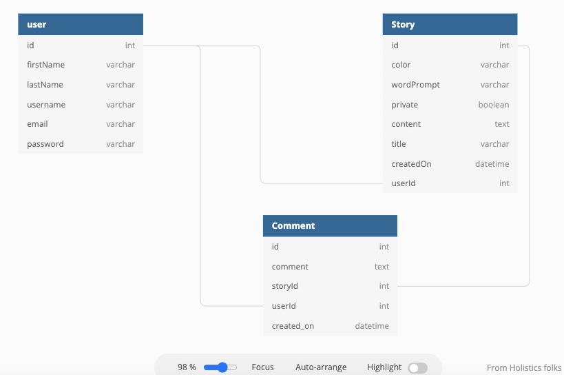
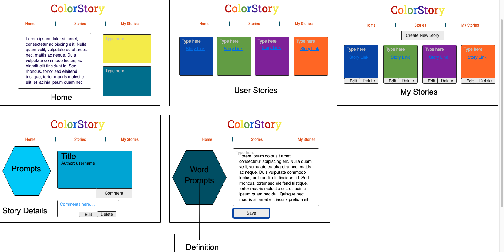

# ColorStory

ColorStory is a creative writing exercise application to get those creative juices flowing. Users
are given 2000 characters to write a short story. Because different colors evoke different emotions for each of us, users are given a random color as a prompt, as well as a random word. Users have the choice to make their stories public or private. If the story is made public, other users can read and comment on the short stories. If the story is made private, only the author of that story can view it. They also have the option to edit or delete each story.

## ColorStory ERD

## ColorStory Wireframe

